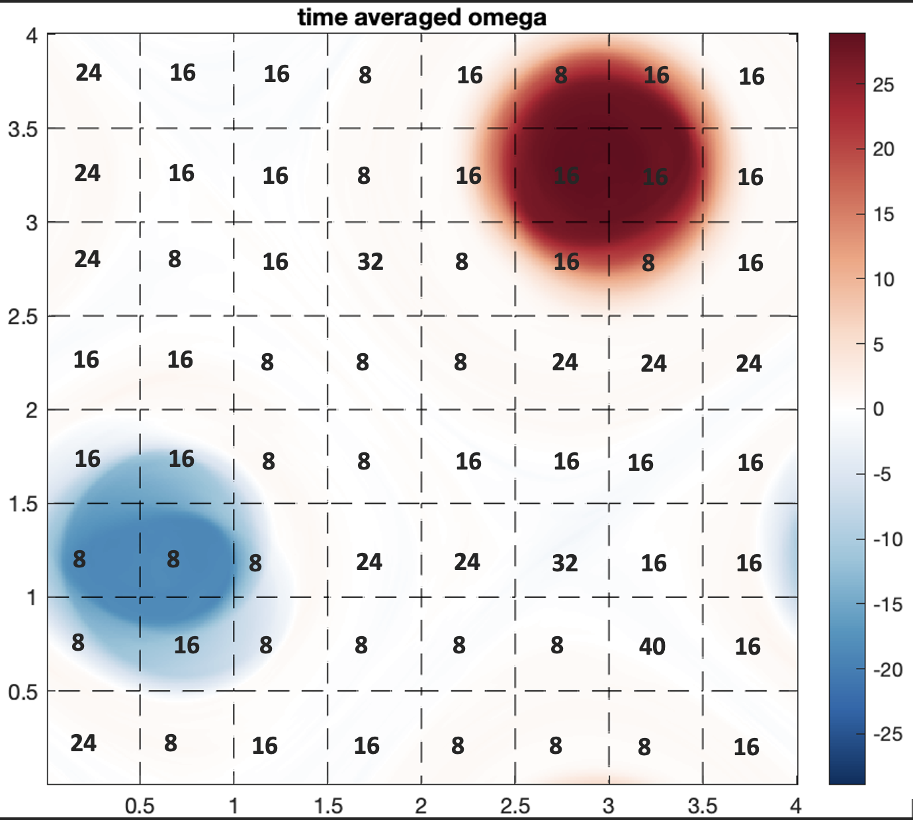
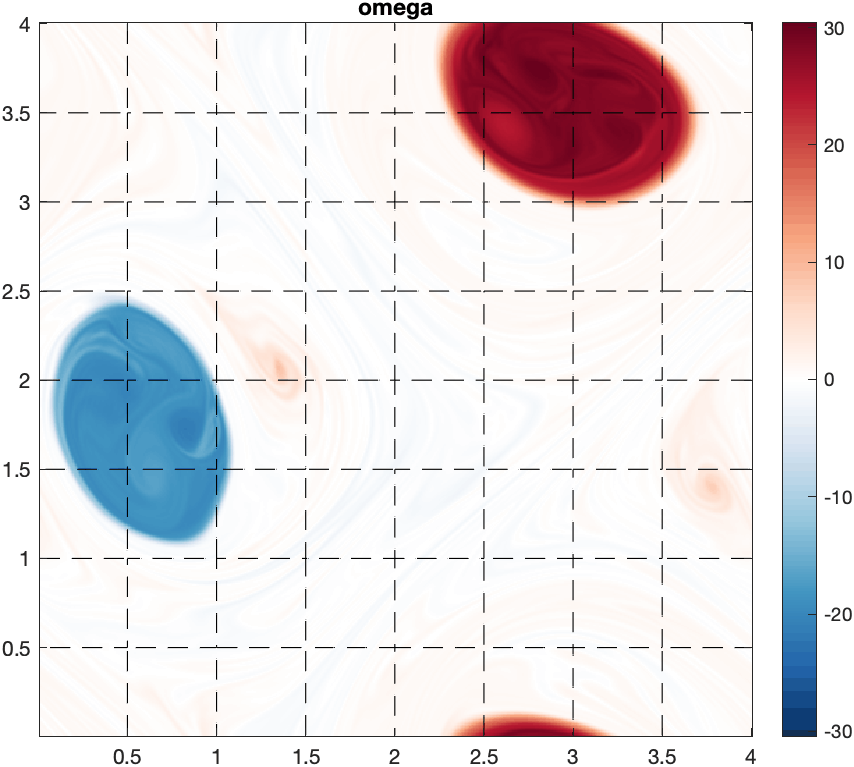

# Autoencoders
This repository documents my reserach projects as an undergraduate in Dr. Roman Grigoriev's Non-Linear Dynamics and Chaos lab at Georgia Tech.
My main project is applying Autoencoders to the problem of modeling fine structure dynamics in turbulent data. This is an imortant problem because fine structure is both important and extremely expensive to simulate in detail. Autoencoders have proven to be effective in many areas for dimensionality reduction. Reduced dimensional modeling of fine structure in turbulent systems would reduce the computational cost of accurate models. 

This project started by reproducing the results produced by Graham and Linot who showed the dimensionality of the inertial manifold of the Kuramoto-Sivashinky system (https://arxiv.org/pdf/2109.00060.pdf).

I then explored a simple 1D PDE to gain more intuiton with Autoencoders.

The current work is focused on the 2-D Navier Stokes equations and finding low dimensional representations of the fine structure. Autoencoders may also be useful for quantifying the separation between high dimensional and low dimensional structure. 

Below is a simple Autoencoder applied to time averaged numerical data of the 2D Navier-Stokes equation. It is split into sixty-four spatial subdomains with their corresponding latent dimension reported by the Autoencoder. This is still a work in progress and I am applying more sophisticated techniques to increase accuracy and trust in the network, but it serves as a visual example of the kind of work I am currently doing. 

_______________________________________________________________
# Vorticity field

