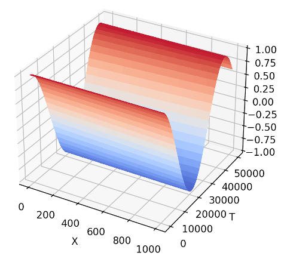
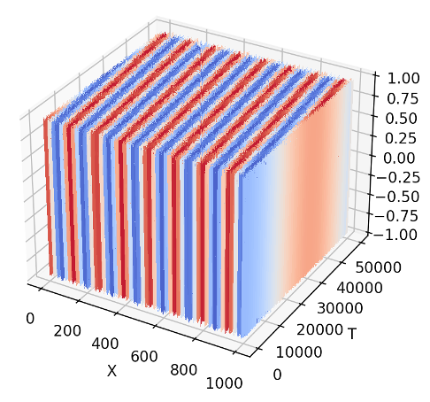
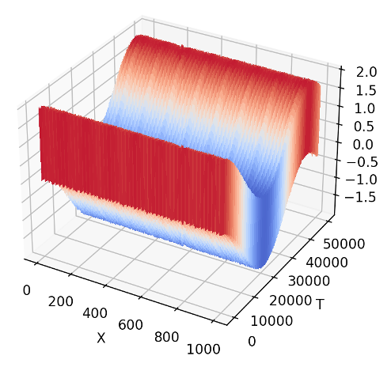
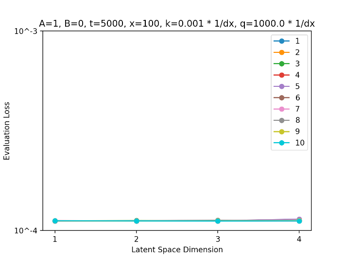
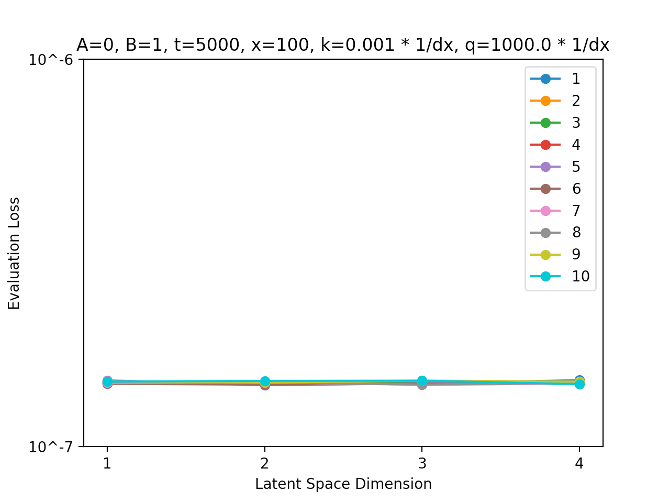
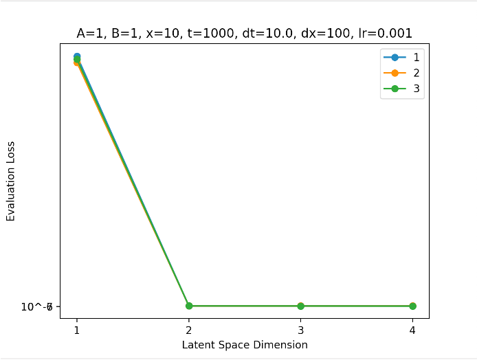
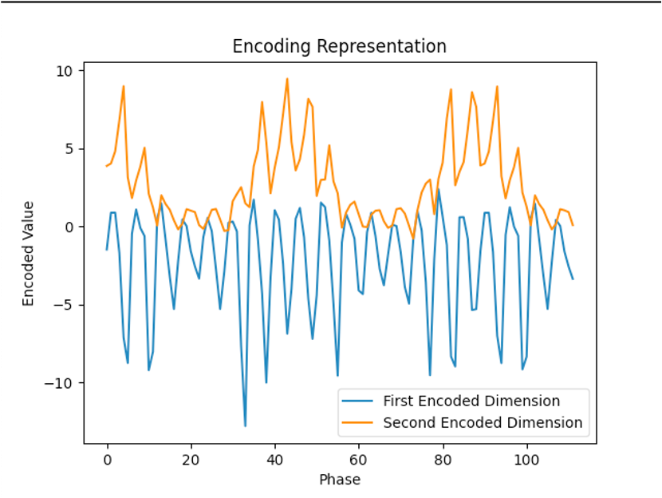
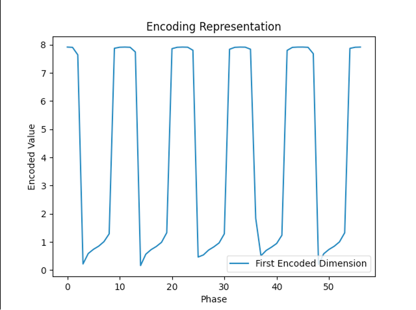
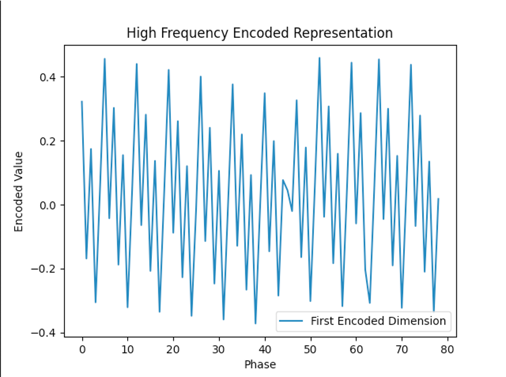

# Autoencoders
This repository documents my reserach projects as an undergraduate in Dr. Roman Grigoriev's Non-Linear Dynamics and Chaos lab at Georgia Tech.
I have focused on applying Autoencoders to model fine structure dynamics in turbulent data. This is a well-posed problem because fine structure is both important and extremely expensive to simulate in detail. While Autoencoders have proven to be effective in many areas for dimensionality reduction, no one currently knows how to apply them properly to learn the fine strcture dynamics of turbulent systems.  Reduced dimensional modeling of fine structure would cut the computational cost of accurate models and bring important dynamics into our understanding of turbulent systems. 

The question is do Autoencoders work in this way? Well, yes! They do seem to have promise in discovering models of physical systems. To motivate this let's consider a 1-D PDE whose solution is a simple sum of cosines
$$Acos(ku) + Bcos(qu)$$
$$u=x+ct, \text{   } c=\pi$$
$$k << \frac{1}{dx}, \text{    } q >> \frac{1}{dx}.$$

There are many situations in which you may expect solutions to consist of high and low frequency components. The graphs of the high frequency component, the low frequency component, and their sum, respectively, are shown below.

We would expect an Autoencoder to learn the first and second components with just one dimensional latent spaces and their sum with a two dimensional latent space. So, we train Autoencoders on each component with sparse data.

This is exactly what we expected. For both the high and low frequency components the Autoencoder learned nothing past the first latent dimension while for their sum it learned nothing beyond the second latent dimension. In other words, the individual components are one dimensional and their sum is two dimensional as expected.    
Now, we know that the Autoencoder CAN learn this data with the proper amount of dimensions, but WHAT does it learn? Does it learn what a cosine is or does it find some abstract representation? Below is the plot of the latent space for the entire solution (i.e., the sum of the cosines).

We can see that there is some coupling between the components because this Autoencoder was allowed a three dimensional latent space and it has no incentive to completely seperate the components. However, we can clearly make out a low freqeuncy cosine in orange and relatively higher freqeuncy cosine in blue. If we train two Autoencoders with single dimensional latent spaces on the two components then we should clearly see a low and high frequency cosine in their respective latent spaces.

This is a very encouraging result. If one were to only have the data and observe the latent space representation one could easily see that the data is the sum of two cosines. Once this is known an application of the 2D Fourier Transform to the data would recover the Fourier modes with their coefficients and completely discover the model that produced this data. This example provides strong motivation for applying Autoencoders to discovering models for more complicated systems. Further work in using machine learning for model discovery may provide techniques for illuminating machine learning models in many domains and help increase trust and understanding, which are vital to the responsible use of artificial intelligence.

The current work is focused on the 2-D Navier Stokes equations and finding low dimensional representations of the fine structure. Autoencoders may also be useful for quantifying the separation between high dimensional and low dimensional structure. 

Below is a simple Autoencoder applied to time averaged numerical data of the 2D Navier-Stokes equation. It is split into sixty-four spatial subdomains with their corresponding latent dimension reported by the Autoencoder. This is still a work in progress and I am applying more sophisticated techniques to increase accuracy and trust in the network, but it serves as a visual example of the kind of work I am currently doing. 

_______________________________________________________________
# Vorticity field

